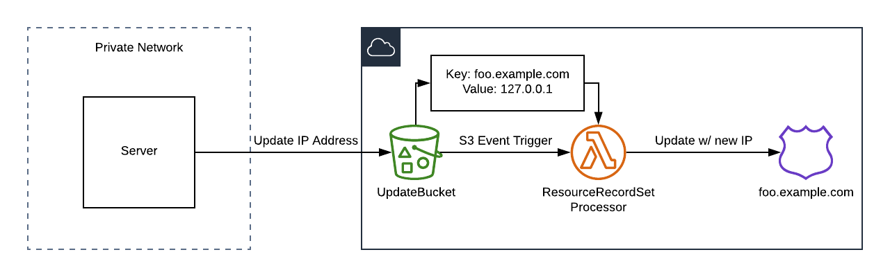

# aws-ddns

A small, simple, dynamic dns solution backed by AWS services.

#### Table of Contents

- [Motivation](#motivation)
- [Architecture Overview](#architecture-overview)
- [Usage](#usage)
  - [Account Infrastructure](#account-infrastructure)
  - [Initial Project Setup](#initial-project-setup)
  - [Ongoing Maintenance](#ongoing-maintenance)

## Motivation

This project is geared towards developers that have spare hardware lying around
at home, and potentially already work with AWS (or a competing cloud provider).

While many dynamic DNS providers already exist, some integrated neatly into
popular home routers, they all have various drawbacks. Most free tiers from
these providers require regular reconfirmation, lack custom domain support, or
support a restricted number of hosts. Most paid solutions range anywhere from 
$2 to $20 USD per month to use.

With very little hardware (an old computer, raspberry pi, whatever's on hand)
one can create a dynamic dns solution using AWS technologies that costs around
$1 USD per month to maintain.

## Architecture Overview

`aws-ddns` is made up of a few components:

  - A computer on the private network that can upload to S3
  - An S3 bucket that contains ip address information
  - A Lambda function triggered by S3 create/update events
  - An `A` record pointed at the desired ip address

## Usage

### Account Infrastructure

### Initial Project Setup

### Ongoing Maintenance
